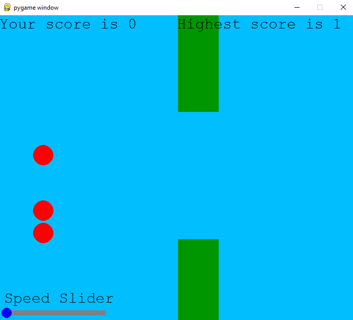

# GeneticAlgorithm_FlappyBird
Neuroevolution with popular game Flappy bird

Genetic algorithm is setting up all weights of feed forward neural network. This network is then trying to predict best move.
Currently not working, coeficients of genetic algorithm are not set up correctly, so algorithm is not converging to global minimum.

